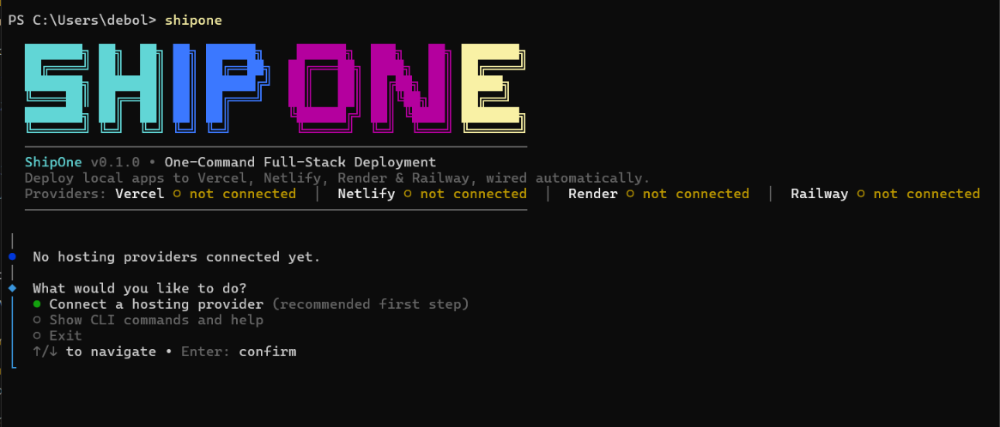
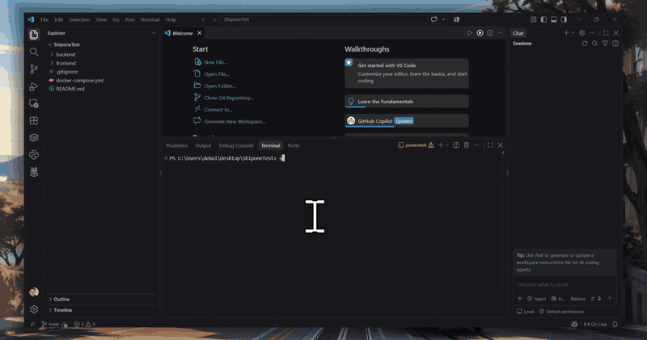
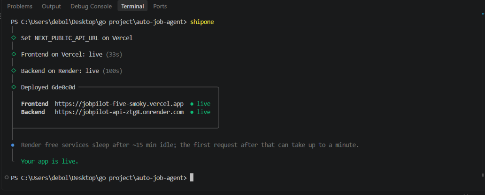

<div align="center">

# ShipOne

### **Ship your full-stack project in under 1 minute — with one command.**

[](https://www.npmjs.com/package/shipone)
[](./LICENSE)
[](https://github.com/DebasisCode/shipone/actions/workflows/ci.yml)
[](https://nodejs.org)

**Free & open source.** Works with your own Vercel, Netlify, Render and Railway accounts.



</div>

---

## The problem every developer knows

You just finished building your app. The code is done. But the app is not **live** — and going live is the annoying part:

- Open 3 different websites and create the same project twice (frontend here, backend there)
- Copy the frontend's web address, paste it into the backend's settings
- Copy the backend's web address, paste it into the frontend's code
- Hit the scary browser security error because the two halves can't talk to each other
- Google the fix, change a setting, redeploy, hope it works

**30–60 minutes of clicking, every single project.** And you'll do it all again tomorrow.

## The solution

```bash
shipone
```

That's it. ShipOne looks at your project, understands what it's made of, and takes it live — while you watch.



- **It figures everything out by itself** — which folder is your website, which is your server, how to build and start each one. See the supported stacks below.
- **It introduces your frontend and backend to each other** — addresses exchanged both ways, and the browser security wall configured before anything goes live, so the common first-visit CORS and env-var failures don't happen.
- **It asks only for what it can't know** — like your database password. Everything else is filled in for you.
- **It watches the build for you** — and if something fails, it shows you exactly the lines that broke.
- **Run it again anytime** — it finds your existing project instead of creating a second one. Two runs, same app.

## What makes it different

Most deploy tools do **one half** of your app and leave the hard part to you.

| | Other tools | ShipOne |
|---|---|---|
| Deploys your frontend | Yes | Yes |
| Deploys your backend | Yes | Yes |
| **Wires them together** (API address + security) | You do it manually | Automatic, before launch |
| **Your own accounts** — no vendor lock-in, no markup | Some take a cut or lock you in | Deploys into **your** Vercel / Netlify / Render / Railway |
| **Catches mistakes before they go live** (hardcoded localhost, missing port, forgotten secrets) | No | Warns you *before* deploying |
| Multiple hosts, your pick per project | No | Connect all four, choose per project |

ShipOne's niche: **deploy a full-stack app into your own existing accounts, across four providers, with the frontend/backend wiring done for you** — no dashboard clicking, no vendor lock-in.

## Quick start (under 60 seconds)

**1. Install it**

```bash
npm install -g shipone
```

<details>
<summary>Other package managers</summary>

```bash
pnpm add -g shipone
```
```bash
yarn global add shipone
```
```bash
bun add -g shipone
```

</details>

No install at all? Run it directly:

```bash
npx shipone
```

> You need **Node.js 22+** and **git** on your machine.

**2. Connect your account (one time ever)**

ShipOne opens your browser, you paste a token from your hosting dashboard — done. It's stored only on your machine, readable only by you.

**3. Go live**

```bash
shipone
```

Pick **Deploy this project**, confirm, and watch your app go live.




## Which hosts can I use?

| Your website lives on | Your server lives on |
|---|---|
| **Vercel** · **Netlify** | **Render** · **Railway** |

Connect one of each — or all four. If several are connected, ShipOne simply asks which one you want for this project, remembers your choice, and never asks again for that project.

## Supported stacks

ShipOne detects your folders automatically; you can always override them in `.shipone.yml`.

**Frontend** — Vite, Next.js, Create React App, Angular, SvelteKit, Astro, Nuxt, Gatsby, Remix, React Router (v7 framework mode), SolidStart, Vue CLI.

**Backend** —
- **Node.js**: Express, Fastify, Koa, Hapi, NestJS, Hono, Adonis (npm / yarn / pnpm)
- **Python**: FastAPI, Flask, Django (pip / poetry / uv / pipenv)
- **Go**, **Rust**, **Ruby** (Rails, Sinatra)
- **Anything with a Dockerfile** — if we can't detect it, a `Dockerfile` always works

## Known limitations

Being upfront about what ShipOne doesn't (yet) do:

- **No automatic database provisioning.** Bring your own hosted DB (Neon, Supabase, Atlas, Redis…) — if your `.env.example` lists e.g. `DATABASE_URL`, ShipOne collects the connection string (offering the cloud value from your local `.env`) and sets it on the backend before deploying. You paste one string; ShipOne never creates the database itself.
- **No custom domains.** Apps live on the provider's default URL (`*.vercel.app`, `*.onrender.com`, …) for now.
- **No auto-deploy on git push.** Deploys happen when you run `shipone` — deliberate, so nothing goes live without you.
- **No monorepo task runners.** Detection understands multi-folder repos, but not Turborepo/Nx pipelines.
- **Windows, macOS and Linux are supported** — but exotic shells (fish, nushell) are untested.

## It plays nice with your project

On the first deploy, ShipOne saves a tiny `shipone.yml` file in your repo — your project's memory. Commit it, and anyone on your team gets the exact same one-command experience.

Want to fine-tune it? Open the file — folder names, host choice, custom build commands. It's 6 lines of plain settings.

## Uninstall

Two steps — first make ShipOne forget your data, then remove the tool:

```bash
shipone uninstall          # forgets tokens, settings and project history
```

Then remove the CLI itself:

```bash
npm uninstall -g shipone
```
```bash
pnpm remove -g shipone
```
```bash
yarn global remove shipone
```
```bash
bun remove -g shipone
```

> **Your live apps are never touched.** They keep running in your Vercel / Netlify / Render / Railway accounts — uninstalling only cleans your machine.

## Good to know

- **Does pushing code auto-deploy?** No. Your app only changes when *you* run `shipone`. No surprise deploys.
- **Does it touch my code?** It adds one small settings file. That's all.
- **Where do my tokens live?** In a private file on your machine (`~/.shipone`). Never in your code, never sent anywhere but the host you chose.
- **What does it cost?** Nothing. ShipOne is free and open source — you deploy into your own accounts, on their free tiers.

---

<div align="center">

**Built for developers who'd rather ship than click.**

[Star it on GitHub](https://github.com/DebasisCode/shipone) — [Report an issue](https://github.com/DebasisCode/shipone/issues)

</div>